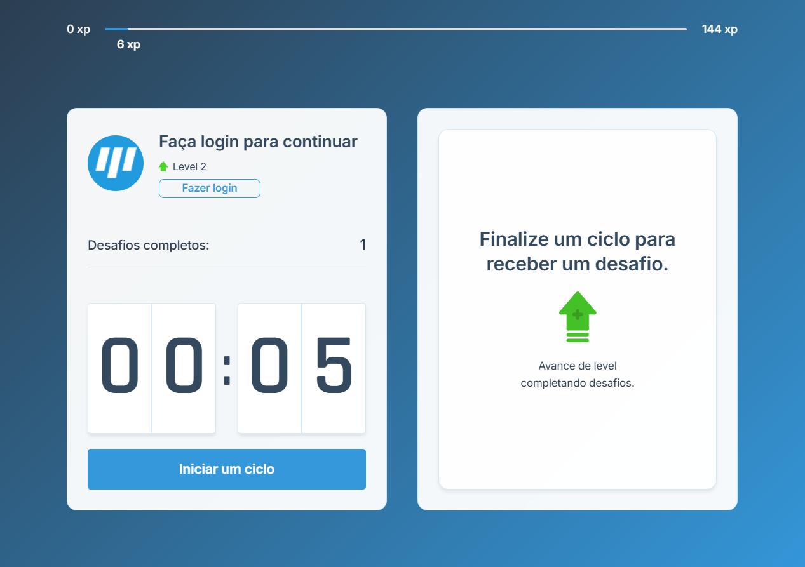

## About the project

Shake.IT is a web application based on the Pomodoro Technique, but with additional functionalities and dedicated to IT professionals.

Most of the IT professionals spend several hours in front of the computer without streching, what can lead to health problems.
So, Shake.IT aims to help these professionals to find a balance between focus time and straching time, by suggesting popular and simple straching exercises. It also brings a schema of points for each completed exercise, challenging the users to continue using it and grow in points and levels.

#### Link in production: [https://shakeit-next.vercel.app](https://shakeit-next.vercel.app/)


## 🛠 Technologies and concepts
- [ReactJS][reactjs]
- [Next.js][nextjs]
- [TypeScript][typescript]
- [Context API][context]
- [Auth0][auth0]
- [Cookies][js_cookie]
- [React Hooks][hooks]
- [Vercel][vercel] for hosting
- Modal panel in ReactJS
- Browser notification


## 💡 The application

<p align="left" style="display: flex; align-items: flex-start; justify-content: center;">
    
    
</p>
<p align="left" style="display: flex; align-items: flex-start; justify-content: center;">
    
    
</p>


## 🎲 How to clone the project

Before starting, you will need to install:
- [Git](https://git-scm.com). 
- [Node.js][nodejs].
- [Yarn][yarn].
- It will also be good to have a code editor: [VSCode][vscode]

```bash
# Clone the repository.
$ git clone https://github.com/vagner-vengue/shakeit-next

# Access the folder.
$ cd shakeit-next

# Install all the dependences
$ yarn install

# Start the application
$ yarn start

# The applicaton will run at: http://localhost:3000
```


## 📝 License

This project is under the MIT license. Please see [LICENSE](license) for more details.

It was created by Vagner Vengue. ([LinkedIn](https://br.linkedin.com/in/vagner-vengue-aa8b5b19))


## 🙏Acknowledgements

Thanks [Rocketseat][rocketseat] for providing the basis for this project.

The base project was developed during the "NextLevelWeek 4.0", a free course provided by Rocketseat with the goal of taking the React community to a next level of knowledge, with recent and modern software development technologies.

[typescript]: https://www.typescriptlang.org/
[reactjs]: https://reactjs.org
[rn]: https://facebook.github.io/react-native/
[nextjs]: https://nextjs.org
[auth0]: https://auth0.com/
[vercel]: https://vercel.com/
[js_cookie]: https://www.npmjs.com/package/js-cookie
[hooks]: https://reactjs.org/docs/hooks-intro.html
[context]: https://reactjs.org/docs/context.html
[nodejs]: https://nodejs.org/
[yarn]: https://yarnpkg.com/
[vscode]: https://code.visualstudio.com/
[license]: https://github.com/vagner-vengue/shakeit-next/blob/main/LICENSE
[rocketseat]: https://rocketseat.com.br
